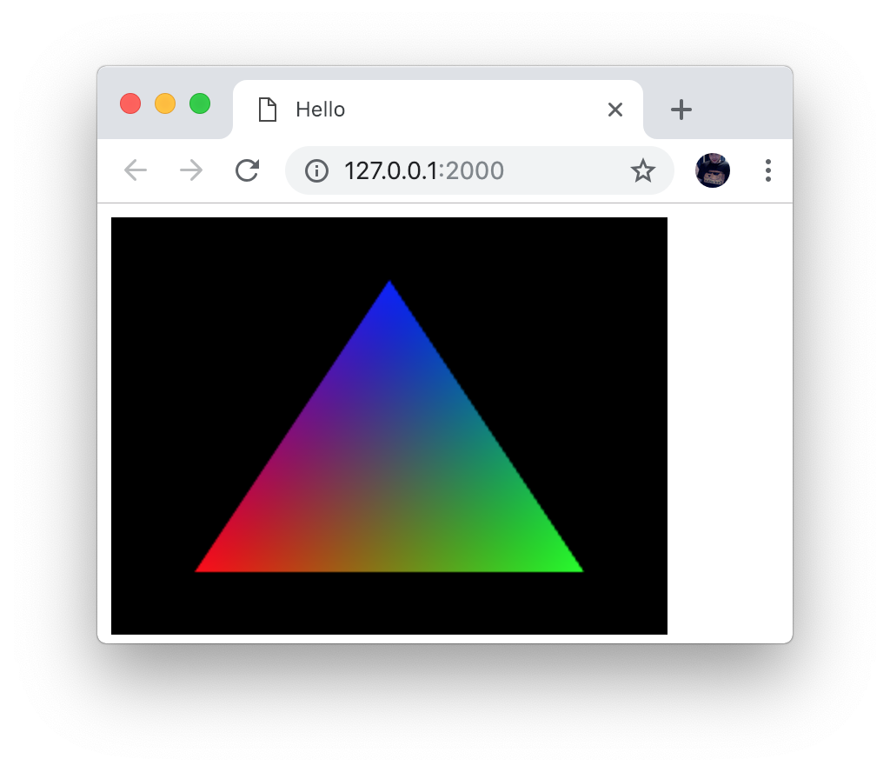

# Hello, triangle!

The first test every graphics project starts with.

Requirements:

1. [Rust](https://www.rust-lang.org/)
2. [wasm-opt](https://github.com/WebAssembly/binaryen)
3. Your preferred http server (I like [live-server](https://www.npmjs.com/package/live-server))
4. A browser that supports `webGL`, and `wasm`

To build:

```sh
$ ./build.sh release
```

To run:

```sh
$ cd dist/
$ live-server --port=2000
```

Open your browser to http://127.0.0.1:2000 and you should see your triangle.

